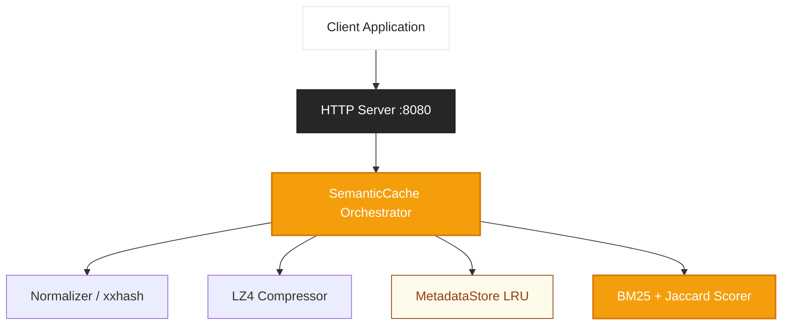

# Architecture — Erion Ember v3


Erion Ember is a standalone Go binary providing semantic caching via a REST/JSON API. It is designed for simplicity, performance, and ease of deployment.

## Architectural Principles

- **Simplicity**: Single binary, zero external dependencies.
- **Performance**: Two-tier matching (Fast & Slow paths) ensures sub-microsecond response times for identical queries.
- **Efficiency**: Memory-safe implementation with transparent LZ4 compression.
- **Robustness**: Incremental IDF updates ensure similarity matching improves as the cache grows.

## System Components



### 1. SemanticCache (Orchestrator)
The central component that coordinates text normalization, hash lookup (fast path), and similarity scanning (slow path).

### 2. Normalizer & xxhash
Standardizes input text (lowercase, whitespace collapse) and computes a 64-bit hash for O(1) exact match lookups.

### 3. BM25 + Jaccard Hybrid Scorer
Computes similarity between tokens. BM25 provides statistical weight to important terms, while Jaccard ensures overlap sensitivity.

### 4. MetadataStore (LRU)
A thread-safe in-memory store using a hash map for lookups and a doubly-linked list for Least Recently Used (LRU) eviction.

## Request Flow

### Fast Path (Exact Match)
1. **Normalize**: Clean input string.
2. **Hash**: Generate `xxhash`.
3. **Lookup**: Check `MetadataStore` by hash.
4. **Return**: On hit, decompress response and return immediately (~0.1 µs).

### Slow Path (Semantic Similarity)
1. **Miss**: If fast path misses, tokenize the normalized prompt.
2. **Scan**: Iterate through `MetadataStore` entries.
3. **Score**: Run hybrid scorer against candidates.
4. **Threshold**: If highest score ≥ threshold, return hit; otherwise, return miss.

## Data Model

The `Entry` struct is the primary unit of storage:

```go
type Entry struct {
    ID                   string
    PromptHash           uint64        // xxhash of cleaned prompt
    Tokens               []string      // For similarity scan
    NormalizedPrompt     string
    CompressedPrompt     []byte        // LZ4 compressed
    CompressedResponse   []byte        // LZ4 compressed
    OriginalResponseSize int
    CreatedAt            time.Time
}
```

## Performance Scaling

The slow path latency scales linearly with cache size:

| Cache Size | Latency |
|------------|---------|
| 1K entries | ~10 µs |
| 10K entries | ~100 µs |
| 100K entries | ~1 ms |

For deployments exceeding 1 million entries, we recommend sharding or introducing a vector database back-end.

---

## Visual Identity & Design Tokens

Erion Ember follows a cohesive brand identity inspired by the "Ember" visual metaphor.

| Token | Value | Description |
|-------|-------|-------------|
| **Primary** | `#f59e0b` | The core radiant amber color. |
| **Foundation** | `#262626` | Deep charcoal for technical stability. |
| **Typography** | `Inter` | High-performance sans-serif for UI. |

Full branding specifications can be found in [IDENTITY_GUIDE.md](../assets/IDENTITY_GUIDE.md).
